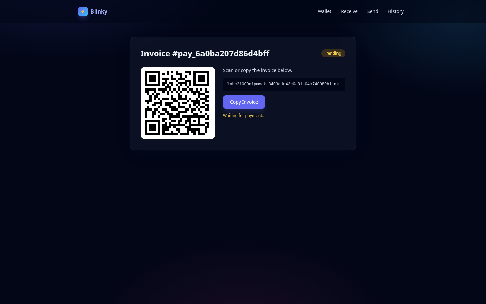
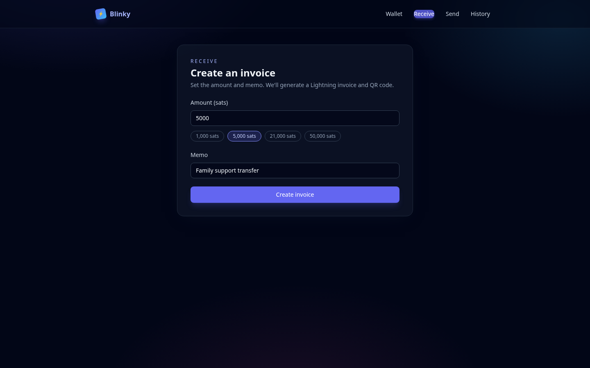
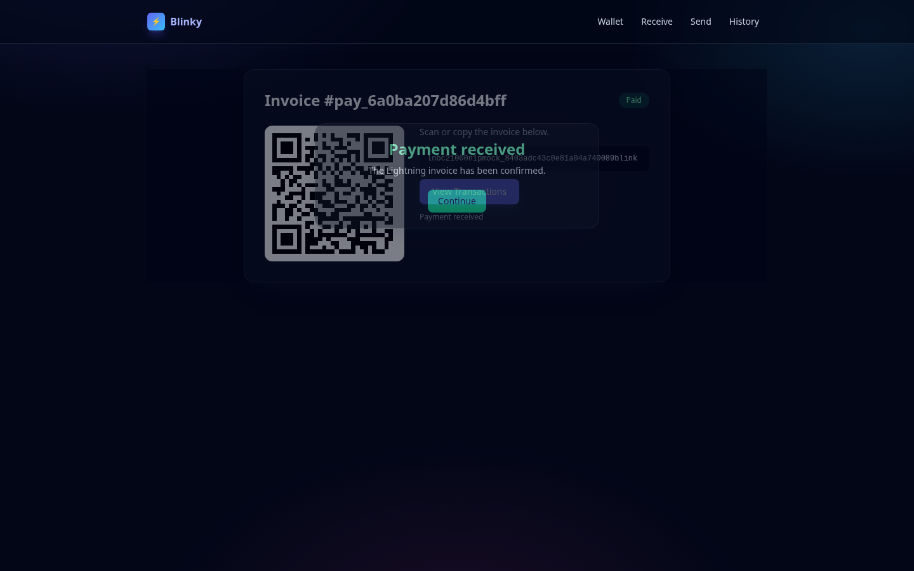
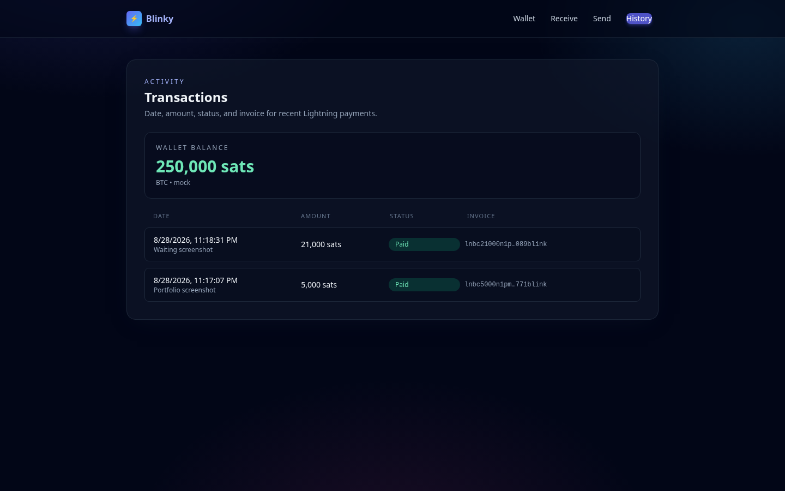

# Blinky Lightning Wallet

A Lightning payment reference implementation demonstrating external payment-provider integration, asynchronous payment confirmation, webhook reliability, idempotency, and clean payment-state management.



## Why I built this

Lightning payments are not request/response. A client can create an invoice immediately, but the satoshis arrive later — if they arrive at all. That requires reliable coordination between:

```text
Client
API
Payment Provider
Webhook
Database
```

Blinky is the focused project that shows I have done that integration work with [Blink](https://www.blink.sv): create a Lightning invoice, wait, process the webhook, and only then mark the payment paid.

This repository is intentionally smaller than a full wallet-ledger system. The point is payment integration, not infrastructure theatre.

## Key Features

- Blink Lightning integration (GraphQL)
- Lightning invoice creation
- Outgoing invoice payment via `lnInvoicePaymentSend`
- Asynchronous payment confirmation
- Svix webhook processing
- Durable webhook idempotency
- Explicit payment state management (`PENDING` / `PAID` / `FAILED` / `EXPIRED`)
- Provider abstraction (`BlinkProvider` + `MockPaymentProvider`)
- Frontend polling with terminal-state stop
- Consistent API error handling
- Automated unit and integration tests
- Docker Compose
- GitHub Actions CI

## Architecture

```text
              ┌──────────────┐
              │   Frontend   │
              └──────┬───────┘
                     │
                     ▼
              ┌──────────────┐
              │  NestJS API  │
              └──────┬───────┘
                     │
                     ▼
              ┌──────────────┐
              │PaymentService│
              └──────┬───────┘
                     │
                     ▼
              ┌──────────────┐
              │Blink Provider│
              └──────┬───────┘
                     │
                     ▼
                Blink API
                     │
                     ▼
             Lightning Network


Blink Webhook
      │
      ▼
Webhook Processor
      │
      ▼
Payment State
      │
      ▼
Frontend polling
```

More detail: [docs/architecture.md](docs/architecture.md).

## Payment Flow

```text
User
 ↓
Create payment
 ↓
Blink creates Lightning invoice
 ↓
User pays invoice
 ↓
Blink webhook
 ↓
Webhook processor
 ↓
Payment state updated
 ↓
Frontend polls status
 ↓
Payment confirmed
```

## Reliability

### Idempotency

Webhook events are persisted in MongoDB with a unique `(provider, eventId)` index. If Blink retries the same event ten times, the payment is processed once.

### State management

Only `PENDING → PAID | FAILED | EXPIRED` is allowed. Terminal states do not move backwards, so a late pending event cannot un-pay a payment.

### Failure handling

Blink timeouts become `504`. Provider outages become `503`. Invalid identifiers become `400`. Missing payments become `404`. Internal stack traces are not returned.

See [docs/failure-scenarios.md](docs/failure-scenarios.md).

## API

| Method | Path | Purpose |
| --- | --- | --- |
| `POST` | `/api/v1/invoices` | Create a Lightning invoice |
| `GET` | `/api/v1/invoices/:invoiceId` | Read payment status |
| `POST` | `/api/v1/payments/decode` | Decode a bolt11 invoice |
| `POST` | `/api/v1/payments/pay` | Pay an invoice via Blink |
| `GET` | `/api/v1/payments` | Payment history |
| `POST` | `/api/v1/webhooks/blink` | Blink/Svix webhook |
| `GET` | `/api/v1/health` | Health + Mongo ping |

Swagger UI: [http://localhost:4001/api/docs](http://localhost:4001/api/docs)

Payment statuses: `PENDING`, `PAID`, `FAILED`, `EXPIRED`.

## Tech Stack

- TypeScript
- NestJS
- MongoDB / Mongoose
- React, Vite, Tailwind CSS
- Blink GraphQL API
- Jest, Vitest, GitHub Actions, Docker Compose

## Running Locally

```bash
cp .env.example .env
cp backend/.env.example backend/.env
cp frontend/.env.example frontend/.env
npm install
npm run dev
```

- API: [http://localhost:4001/api/v1/health](http://localhost:4001/api/v1/health)
- Web: [http://localhost:5174](http://localhost:5174)
- Docs: [http://localhost:4001/api/docs](http://localhost:4001/api/docs)

With Docker (Mongo + API + web, mock provider by default):

```bash
docker compose up --build
```

Mock mode (`PAYMENT_PROVIDER=mock`, or empty `BLINK_API_KEY`) creates invoices without calling Blink. Live mode needs a Blink API key, wallet id, and webhook secret.

## Environment Variables

Defined in `.env.example`:

| Variable | Purpose |
| --- | --- |
| `MONGO_URI` | MongoDB connection string |
| `BLINK_API_URL` | Blink GraphQL endpoint |
| `BLINK_API_KEY` | Blink API key |
| `BLINK_WALLET_ID` | Blink wallet to receive/send from |
| `BLINK_WEBHOOK_SECRET` | Svix signing secret (`whsec_…`) |
| `API_PORT` | NestJS port (default `4001`) |
| `PAYMENT_PROVIDER` | `mock` or `blink` |
| `FRONTEND_ORIGIN` | Allowed CORS origin |
| `VITE_API_BASE_URL` | Frontend API base URL |

Never commit `.env`. Secrets are not logged.

## Testing

```bash
npm test
npm run test:e2e
```

High-value scenarios:

- Valid and invalid payment state transitions
- Invoice creation and retrieval
- Valid / invalid webhooks
- **Same webhook delivered 10 times → payment processed once, final state `PAID`**
- **Late `PENDING` event after `PAID` → state stays `PAID`**
- Provider success, error, and timeout
- Frontend polling stop conditions

Tests use `MockPaymentProvider` and in-memory MongoDB. They do not need Blink credentials.

## Architecture Decisions

- **Provider abstraction** — Blink GraphQL stays behind `PaymentProvider`. Tests inject a mock. The rest of the app does not care.
- **Webhook idempotency** — uniqueness is in the database, not an in-memory `Set`. Restarts do not replay side effects.
- **Payment state model** — four statuses and a small transition function. Enough to be correct, not a generic state machine.
- **Polling vs WebSockets** — polling is enough for invoice settlement UX and keeps the demo honest. Blink already pushes the source of truth via webhooks.

## Future Improvements

- Register the webhook URL with Blink from the app (`callbackEndpointAdd`) instead of the dashboard
- Revive or reconcile invoices that expire locally but settle on Lightning afterwards
- Optional authenticated access if this is ever exposed beyond a demo wallet

## Screenshots








## GitHub

Suggested repository description:

> Lightning payment wallet demonstrating Blink integration, asynchronous payment confirmation, webhook reliability, idempotency, and payment state management.

Suggested topics: `typescript`, `nestjs`, `bitcoin`, `lightning`, `payments`, `fintech`, `webhooks`, `idempotency`, `docker`.
